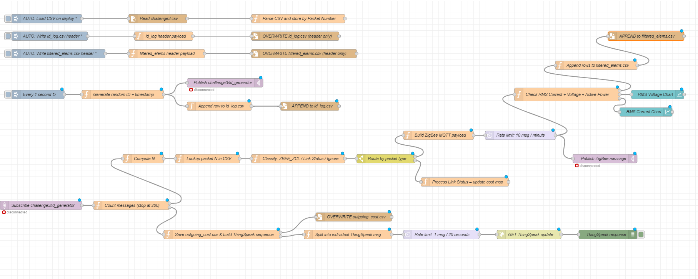
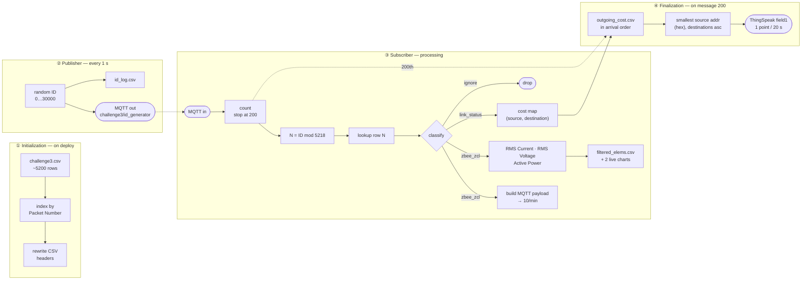

<h1 align="center">ZigBee → MQTT → ThingSpeak, in one Node-RED flow</h1>

<p align="center">
  <em>IoT Challenge #3 — Politecnico di Milano (ANTLab), A.Y. 2025/2026</em>
</p>

<p align="center">
  
  
  
  
  
</p>

---

A ~5200-row Wireshark capture of a ZigBee network goes in. Out the other end come a
live dashboard, three CSV files and eight points plotted on a public ThingSpeak
channel — and in between, a publisher and a subscriber talking to each other over a
local MQTT broker, exactly 200 messages, then silence.

That is the whole assignment. This repo is the flow that does it, plus the notes I
wish I'd had when I started.

<p align="center">
  
</p>

## At a glance

| | |
|---|---|
| **Input** | `challenge3.csv` — ~5200 captured ZigBee packets (provided by the course) |
| **Transport** | MQTT on `localhost:1884`, topic `challenge3/id_generator` |
| **Rate limits** | 1 ID/second in · 10 ZigBee msg/min out · 1 ThingSpeak point/20 s |
| **Stops after** | exactly 200 messages — counted *before* filtering, as the spec demands |
| **Outputs** | `id_log.csv`, `filtered_elems.csv`, `outgoing_cost.csv`, 2 live charts, 8 ThingSpeak points |
| **Part 1** | Node-RED flow — Golsa Shokri |
| **Part 2** | LoRaWAN spreading-factor exercise — Anasuya Satapathy |

## How the flow is wired

Everything sits on a single Node-RED tab, as four branches running in parallel:



**① Initialization** reads the capture into memory once and indexes it by Packet
Number, so a lookup is O(1) instead of a 5200-row scan per message. It also rewrites
the headers of the two append-mode CSVs, so a re-deploy doesn't pile new data on top
of the old run.

**② Publisher** emits a random ID in `[0, 30000]` plus a UNIX timestamp every second,
publishes it as JSON, and logs it.

**③ Subscriber** listens to the same topic and, per message: counts it, computes
`N = ID mod 5218`, fetches row `N`, then classifies it as `zbee_zcl`, `link_status`
or `ignore`. ZigBee ZCL packets get published onward (rate-limited) and, when they
are *Read Attributes Response* packets, mined for the three electrical attributes.
Link Status packets feed an ordered map of `(source, destination) → cost`.

**④ Finalization** fires on the 200th message: it writes the cost map in arrival
order, picks the numerically smallest source address, sorts its destinations, and
pushes the costs to ThingSpeak one every 20 seconds — the free tier's limit.

A node-by-node walkthrough is in **[`Challenge.pdf`](Challenge.pdf)**, and the
JavaScript of all 15 function nodes is extracted into
**[`src/functions/`](src/functions)** if you'd rather read code than click through
the editor.

## Four things that were harder than they looked

> The parts I actually had to stop and think about — collected here in case they
> save someone else an evening.

<table>
<tr><td width="30"><b>1</b></td><td>

**The Command String column is Python, not JSON.** Single quotes, `True`/`False`/
`None`. It has to be rewritten into real JSON — double quotes, `true`/`false`/`null`
— before anything can parse it.

</td></tr>
<tr><td><b>2</b></td><td>

**Not every ZBEE_ZCL packet carries data.** Only *Read Attributes Response* packets
have Attribute, Status *and* Data Type populated together. *Read Attributes*,
*Report Attributes* and *Default Response* share the same column layout but each
miss a piece — so the filter rejects them at the gate rather than downstream.

</td></tr>
<tr><td><b>3</b></td><td>

**Int16 and Uint16 values arrive as two separate lists.** You can't zip the
attribute list against one value list; you need a cursor per data type, each
advancing independently as you walk the attributes.

</td></tr>
<tr><td><b>4</b></td><td>

**The 200-message gate belongs *before* classification.** Put it after, and dropped
packets stop counting and the flow overshoots. The spec is explicit on this one.

</td></tr>
</table>

## Run it yourself

**You need:** Node-RED 4.x · Mosquitto listening on **`1884`** (not the default
1883 — set it in the config) · `node-red-dashboard` for the charts ·
`challenge3.csv` in Node-RED's working directory.

```text
1.  Node-RED → top-right menu → Import → paste the contents of flows.json
2.  mkdir challenge3_output      # in Node-RED's working dir, before first deploy
3.  open "Split into individual ThingSpeak msg" and replace
    YOUR_THINGSPEAK_WRITE_API_KEY with your own write key
4.  Deploy
```

The CSV loads itself, the headers get rewritten, and the publisher starts emitting
immediately — then stops on its own after 200 IDs.

Working on the flow? `node tools/extract-functions.js` re-exports the function-node
code into `src/functions/`, and `--check` verifies the two haven't drifted apart.

## Part 2 — LoRaWAN spreading factors

A pen-and-paper exercise on a European LoRaWAN network: 40 nodes, λ = 2 pkt/min,
20-byte payload, BW 125 kHz. **[`Exercise.pdf`](Exercise.pdf)** has the full
derivations — this is the short version:

| | Question | Answer |
|---|---|---|
| **EQ1** | Largest SF keeping success rate ≥ 75% under pure ALOHA | **SF7** (≈ 82.5%) — SF8 already falls to ≈ 70% |
| **EQ2** | Performance uneven across nodes after deployment | A **link-budget** problem, not a collision one: **move the nodes closer to the gateway**, don't change SF or drop nodes |

## Repo layout

```
.
├── flows.json                  # the flow — import this into Node-RED
├── flow.png                    # screenshot of the whole tab
├── src/functions/              # the 15 function nodes, as readable .js
├── tools/extract-functions.js  # regenerates src/functions/ from flows.json
├── docs/data/
│   ├── id_log.csv              # the 200 published IDs
│   ├── filtered_elems.csv      # filtered ZBEE_ZCL attribute rows
│   └── outgoing_cost.csv       # ZigBee link cost map
├── Challenge.pdf               # Part 1 report — the flow, node by node
└── Exercise.pdf                # Part 2 report — LoRaWAN exercise
```

`challenge3.csv` is the course's dataset and is not redistributed here.

## Gotchas worth knowing

- The ThingSpeak write key is redacted to `YOUR_THINGSPEAK_WRITE_API_KEY` — bring
  your own.
- ThingSpeak channel `3340710` is public, so the 8 points sent during the assignment
  are still viewable.
- Mosquitto **must** listen on `1884`; on the default port the MQTT nodes simply sit
  there disconnected.
- File-node paths are relative to wherever Node-RED was started from — *not* to the
  location of `flows.json`.

## Team & credits

| | |
|---|---|
| **Golsa Shokri** | Part 1 — Node-RED flow: MQTT routing, ZigBee packet parsing, CSV outputs, dashboard charts, ThingSpeak integration, and the Part 1 report |
| **Anasuya Satapathy** | Part 2 — LoRaWAN spreading-factor analysis, EQ1 and EQ2 derivations, and the Part 2 report |

<sub>Politecnico di Milano — Internet of Things course, May 2026.</sub>
